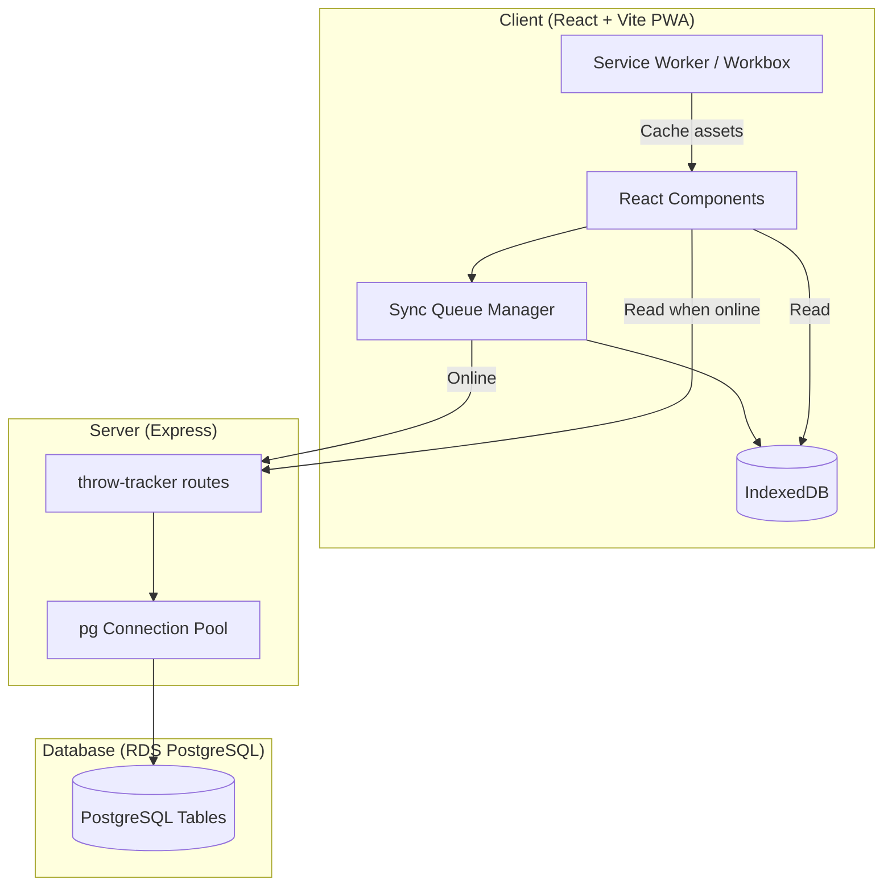
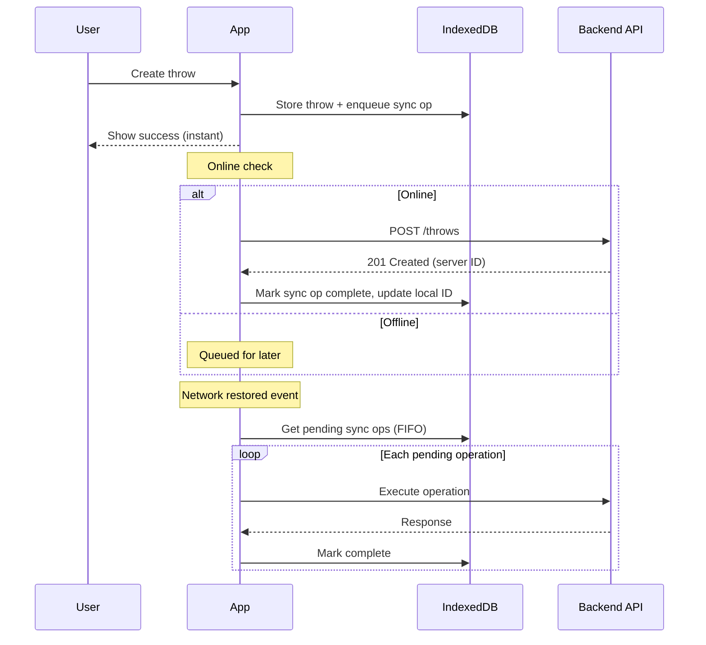

# Design Document: Throw Tracker

## Overview

The Throw Tracker is a mobile-first PWA feature that enables a disc golf player to log practice throws and putting sessions, manage a disc inventory, import historical data from Excel/CSV, and visualize performance trends. It integrates into the existing disc-golf-walkthroughs project by extending the Express backend with new PostgreSQL-backed routes and adding new React pages/components to the Vite frontend.

### Key Design Decisions

1. **Same project, new routes**: The throw tracker lives in the same Vite + Express project. The backend gets a new route file (`server/routes/throw-tracker.js`) and the frontend gets new pages under a `/tracker` route prefix.
2. **PostgreSQL via `pg`**: Raw SQL with the `pg` package — no ORM. A connection pool is established in a shared module.
3. **Offline-first with IndexedDB queue**: All writes go to IndexedDB first, then sync to the server. Reads prefer server data when online, fall back to IndexedDB cache.
4. **No authentication**: Single personal user tool. No auth middleware needed.
5. **SheetJS for Excel import**: The `xlsx` package parses `.xlsx` and `.csv` files client-side before sending structured JSON to the API.
6. **Recharts for visualization**: Lightweight, React-native charting library for line/bar charts.
7. **Workbox for PWA**: Service worker generated via `vite-plugin-pwa` (Workbox under the hood) for precaching and runtime caching strategies.

---

## Architecture



### Data Flow

1. **Write path**: User action → Component → SyncQueue.enqueue(operation) → IndexedDB (immediate) → API (when online)
2. **Read path**: Component mounts → Check online status → If online: fetch from API, update IndexedDB cache → If offline: read from IndexedDB
3. **Sync path**: On `online` event or app focus → SyncQueue drains pending operations in FIFO order → Conflicts resolved by server timestamp (last-write-wins)

---

## Components and Interfaces

### Backend Components

#### Route File: `server/routes/throw-tracker.js`

All throw-tracker endpoints grouped in an Express Router, mounted at `/api/throw-tracker`.

```
Router
├── GET    /discs                    → List all discs
├── POST   /discs                    → Create a disc
├── PUT    /discs/:id                → Update a disc
├── DELETE /discs/:id                → Delete a disc
├── GET    /sessions                 → List throwing sessions
├── POST   /sessions                 → Create a session
├── PUT    /sessions/:id             → Update a session
├── DELETE /sessions/:id             → Delete a session
├── GET    /sessions/:id/throws      → Get throws for a session
├── POST   /sessions/:id/throws      → Create throws (batch)
├── PUT    /throws/:id               → Update a throw (flag/unflag)
├── DELETE /throws/:id               → Delete a throw
├── GET    /putting-sessions         → List putting sessions
├── POST   /putting-sessions         → Create a putting session
├── PUT    /putting-sessions/:id     → Update a putting session
├── DELETE /putting-sessions/:id     → Delete a putting session
├── GET    /putting-sessions/:id/putts → Get putts for a session
├── POST   /putting-sessions/:id/putts → Create putts (batch)
├── PUT    /putts/:id                → Update a putt
├── DELETE /putts/:id                → Delete a putt
├── POST   /import                   → Bulk import sessions/discs/throws
├── GET    /export                   → Export all data as JSON
├── POST   /restore                  → Restore from exported JSON
└── POST   /sync                     → Batch sync queued operations
```

#### Database Module: `server/db.js`

Shared PostgreSQL connection pool configuration:

```javascript
// server/db.js
import pg from 'pg';
const { Pool } = pg;

const pool = new Pool({
  connectionString: process.env.DATABASE_URL,
  ssl: process.env.NODE_ENV === 'production' ? { rejectUnauthorized: false } : false,
});

export default pool;
```

#### Migration File: `server/migrations/001_throw_tracker.sql`

Creates all throw-tracker tables (see Data Models section).

### Frontend Components

#### Page Structure

```
src/
├── pages/
│   ├── tracker/
│   │   ├── Dashboard.jsx          → Overview with recent sessions + quick stats
│   │   ├── Sessions.jsx           → List/create throwing sessions
│   │   ├── SessionDetail.jsx      → View/edit throws within a session
│   │   ├── PuttingSessions.jsx    → List/create putting sessions
│   │   ├── PuttingDetail.jsx      → View/edit putts within a session
│   │   ├── Discs.jsx              → Disc inventory management
│   │   ├── Analytics.jsx          → Charts and trends (tabbed)
│   │   ├── Import.jsx             → Excel/CSV import wizard
│   │   └── Export.jsx             → Data export/restore
├── components/
│   ├── tracker/
│   │   ├── ThrowEntry.jsx         → 3-throw input form for a disc
│   │   ├── PuttEntry.jsx          → Make/miss input for a distance
│   │   ├── DiscCard.jsx           → Disc display card with properties
│   │   ├── DiscForm.jsx           → Add/edit disc form
│   │   ├── SessionForm.jsx        → Create/edit session form
│   │   ├── ChartDistanceTrend.jsx → Line chart for distance over time
│   │   ├── ChartCategoryBar.jsx   → Bar chart for type/stability averages
│   │   ├── ChartConsistency.jsx   → Consistency ranking chart
│   │   ├── ChartPuttingTrend.jsx  → Line chart for putting % over time
│   │   ├── OfflineIndicator.jsx   → Shows sync status
│   │   └── NumericInput.jsx       → Mobile-optimized numeric input
├── hooks/
│   ├── useOnlineStatus.js         → Tracks navigator.onLine
│   ├── useSyncQueue.js            → Manages IndexedDB sync queue
│   └── useTrackerApi.js           → API calls with offline fallback
├── services/
│   ├── syncQueue.js               → IndexedDB queue CRUD operations
│   ├── trackerCache.js            → IndexedDB cache for read data
│   ├── trackerApi.js              → HTTP client for throw-tracker API
│   ├── importer.js                → SheetJS parsing logic
│   └── analytics.js               → Client-side computation for charts
```

#### Key Interfaces

```typescript
// Types (used conceptually — project uses JSX not TSX)

interface Disc {
  id: string;           // UUID
  name: string;
  disc_type: 'Driver' | 'Fairway' | 'Midrange' | 'Putter';
  stability: 'VOS' | 'OS' | 'ST' | 'US' | 'VUS';
  brand: string | null;
  speed: number | null;
  glide: number | null;
  turn: number | null;
  fade: number | null;
  in_bag: boolean;
  created_at: string;
  updated_at: string;
}

interface ThrowingSession {
  id: string;           // UUID
  session_date: string; // ISO date
  location: string;
  conditions: string | null;
  created_at: string;
  updated_at: string;
}

interface Throw {
  id: string;           // UUID
  session_id: string;
  disc_id: string;
  distance_yards: number;
  distance_feet: number; // computed: yards * 3
  throw_number: number;  // 1, 2, or 3 within the set
  flag: 'roller' | 'skip' | 'outlier' | null;
  created_at: string;
}

interface PuttingSession {
  id: string;           // UUID
  session_date: string;
  location: string;
  conditions: string | null;
  created_at: string;
  updated_at: string;
}

interface Putt {
  id: string;           // UUID
  putting_session_id: string;
  distance_feet: number;
  attempts: number;
  makes: number;
  circle: 'C1' | 'C2'; // computed: distance < 33 → C1, else C2
  created_at: string;
}

interface SyncOperation {
  id: number;           // auto-increment
  entity_type: string;  // 'disc' | 'session' | 'throw' | 'putting_session' | 'putt'
  operation: string;    // 'create' | 'update' | 'delete'
  entity_id: string;
  payload: object;
  created_at: string;
  synced: boolean;
}
```

### Offline Sync Strategy



**Conflict Resolution**: Last-write-wins based on `updated_at` timestamp. Since this is a single-user app, conflicts are unlikely — they'd only occur if the same record is edited on two devices before sync. The server timestamp wins.

**Sync Queue Rules**:
- Operations are processed in FIFO order
- If a sync operation fails with a network error, retry with exponential backoff (1s, 2s, 4s, max 30s)
- If a sync operation fails with a 4xx error (validation), mark it as failed and surface to user
- On app startup + on `online` event + every 30 seconds when online: attempt to drain queue

---

## Data Models

### PostgreSQL Schema

```sql
-- Migration: 001_throw_tracker.sql

CREATE EXTENSION IF NOT EXISTS "uuid-ossp";

CREATE TABLE discs (
    id UUID PRIMARY KEY DEFAULT uuid_generate_v4(),
    name VARCHAR(100) NOT NULL,
    disc_type VARCHAR(20) NOT NULL CHECK (disc_type IN ('Driver', 'Fairway', 'Midrange', 'Putter')),
    stability VARCHAR(5) NOT NULL CHECK (stability IN ('VOS', 'OS', 'ST', 'US', 'VUS')),
    brand VARCHAR(100),
    speed NUMERIC(3,1),
    glide NUMERIC(3,1),
    turn NUMERIC(4,1),
    fade NUMERIC(3,1),
    in_bag BOOLEAN NOT NULL DEFAULT true,
    created_at TIMESTAMP WITH TIME ZONE DEFAULT NOW(),
    updated_at TIMESTAMP WITH TIME ZONE DEFAULT NOW()
);

CREATE TABLE throwing_sessions (
    id UUID PRIMARY KEY DEFAULT uuid_generate_v4(),
    session_date DATE NOT NULL DEFAULT CURRENT_DATE,
    location VARCHAR(200) NOT NULL,
    conditions TEXT,
    created_at TIMESTAMP WITH TIME ZONE DEFAULT NOW(),
    updated_at TIMESTAMP WITH TIME ZONE DEFAULT NOW()
);

CREATE TABLE throws (
    id UUID PRIMARY KEY DEFAULT uuid_generate_v4(),
    session_id UUID NOT NULL REFERENCES throwing_sessions(id) ON DELETE CASCADE,
    disc_id UUID NOT NULL REFERENCES discs(id) ON DELETE CASCADE,
    distance_yards NUMERIC(5,1) NOT NULL CHECK (distance_yards >= 0),
    distance_feet NUMERIC(6,1) NOT NULL GENERATED ALWAYS AS (distance_yards * 3) STORED,
    throw_number SMALLINT NOT NULL CHECK (throw_number BETWEEN 1 AND 3),
    flag VARCHAR(10) CHECK (flag IN ('roller', 'skip', 'outlier')),
    created_at TIMESTAMP WITH TIME ZONE DEFAULT NOW(),
    UNIQUE(session_id, disc_id, throw_number)
);

CREATE TABLE putting_sessions (
    id UUID PRIMARY KEY DEFAULT uuid_generate_v4(),
    session_date DATE NOT NULL DEFAULT CURRENT_DATE,
    location VARCHAR(200) NOT NULL DEFAULT 'Backyard',
    conditions TEXT,
    created_at TIMESTAMP WITH TIME ZONE DEFAULT NOW(),
    updated_at TIMESTAMP WITH TIME ZONE DEFAULT NOW()
);

CREATE TABLE putts (
    id UUID PRIMARY KEY DEFAULT uuid_generate_v4(),
    putting_session_id UUID NOT NULL REFERENCES putting_sessions(id) ON DELETE CASCADE,
    distance_feet NUMERIC(4,1) NOT NULL CHECK (distance_feet > 0 AND distance_feet <= 66),
    attempts SMALLINT NOT NULL CHECK (attempts > 0),
    makes SMALLINT NOT NULL CHECK (makes >= 0),
    circle VARCHAR(2) NOT NULL GENERATED ALWAYS AS (
        CASE WHEN distance_feet < 33 THEN 'C1' ELSE 'C2' END
    ) STORED,
    created_at TIMESTAMP WITH TIME ZONE DEFAULT NOW(),
    CONSTRAINT makes_lte_attempts CHECK (makes <= attempts)
);

-- Indexes for common queries
CREATE INDEX idx_throws_session_id ON throws(session_id);
CREATE INDEX idx_throws_disc_id ON throws(disc_id);
CREATE INDEX idx_putts_session_id ON putts(putting_session_id);
CREATE INDEX idx_sessions_date ON throwing_sessions(session_date);
CREATE INDEX idx_putting_sessions_date ON putting_sessions(session_date);
CREATE INDEX idx_discs_in_bag ON discs(in_bag) WHERE in_bag = true;
```

### IndexedDB Schema (Client-Side Cache)

```javascript
// Database: 'throw-tracker-cache', version 1
// Object Stores:
{
  discs:            { keyPath: 'id' },
  throwingSessions: { keyPath: 'id', indexes: ['session_date'] },
  throws:          { keyPath: 'id', indexes: ['session_id', 'disc_id'] },
  puttingSessions: { keyPath: 'id', indexes: ['session_date'] },
  putts:           { keyPath: 'id', indexes: ['putting_session_id'] },
  syncQueue:       { keyPath: 'id', autoIncrement: true, indexes: ['synced', 'created_at'] }
}
```

---

## Correctness Properties

*A property is a characteristic or behavior that should hold true across all valid executions of a system — essentially, a formal statement about what the system should do. Properties serve as the bridge between human-readable specifications and machine-verifiable correctness guarantees.*

### Property 1: Yards-to-feet conversion

*For any* non-negative numeric distance in yards, the computed distance in feet SHALL equal the yard value multiplied by 3.

**Validates: Requirements 2.1**

### Property 2: Throw set average and max computation

*For any* set of exactly 3 non-negative throw distances (in yards), the computed average in feet SHALL equal `(d1 + d2 + d3) * 3 / 3` and the computed maximum in feet SHALL equal `max(d1, d2, d3) * 3`.

**Validates: Requirements 2.3, 2.4**

### Property 3: Invalid throw input rejection

*For any* throw distance value that is non-numeric, negative, or NaN, the validation function SHALL reject the input and the throw list SHALL remain unchanged.

**Validates: Requirements 2.5**

### Property 4: Flagged throw exclusion from analytics

*For any* set of throws where some are flagged (roller, skip, or outlier), all analytics computations (averages, standard deviation, range, rankings, trends) SHALL operate only on the subset of unflagged throws.

**Validates: Requirements 3.2, 6.3, 7.4, 8.4, 9.4, 10.4**

### Property 5: Flag assignment round-trip

*For any* throw and any valid flag value, assigning the flag and then removing it SHALL restore the throw to its original unflagged state.

**Validates: Requirements 3.1, 3.4**

### Property 6: Disc data round-trip

*For any* valid disc with all properties (name, disc_type, stability, brand, flight_numbers, in_bag), storing the disc and then retrieving it SHALL produce an object with all fields equal to the original input.

**Validates: Requirements 4.1, 4.3**

### Property 7: In_bag toggle idempotence

*For any* disc, toggling the in_bag status twice SHALL return the disc to its original in_bag state.

**Validates: Requirements 4.4**

### Property 8: Disc stability grouping order

*For any* set of discs with mixed stability values, the grouping function SHALL produce groups in the order: VOS, OS, ST, US, VUS, then Putters (disc_type='Putter' regardless of stability).

**Validates: Requirements 4.5**

### Property 9: Filter correctness

*For any* collection and filter predicate (in_bag filter, disc_type filter, distance filter, or conditions keyword filter), the filtered result SHALL contain exactly the items that satisfy the predicate — no false positives and no false negatives.

**Validates: Requirements 4.7, 10.3, 11.3, 14.8**

### Property 10: Import parse round-trip

*For any* valid set of session/disc/throw data formatted in the expected spreadsheet structure, parsing with the importer SHALL produce data equivalent to the original input (preserving dates from sheet names, column mappings, and all field values).

**Validates: Requirements 5.1, 5.2, 5.3**

### Property 11: Import summary accuracy

*For any* import input containing N valid rows and M invalid rows (missing required fields), the import summary SHALL report exactly N-M successfully imported items and M skipped rows.

**Validates: Requirements 5.4, 5.5**

### Property 12: Import non-destructive invariant

*For any* existing dataset and any import operation, the count of pre-existing records after import SHALL be greater than or equal to the count before import (no records deleted or overwritten).

**Validates: Requirements 5.6**

### Property 13: Analytics average computation correctness

*For any* set of unflagged throws, the computed average distance per disc per session SHALL equal the sum of distance_feet values divided by the count. The computed average per disc_type and per stability category SHALL follow the same formula applied to the respective group.

**Validates: Requirements 6.1, 7.1, 7.2, 9.1**

### Property 14: Analytics spread computation correctness

*For any* set of unflagged throw distances for a disc, the computed standard deviation SHALL equal the population standard deviation formula applied to those distances, and the computed range SHALL equal max(distances) - min(distances).

**Validates: Requirements 8.1, 8.2**

### Property 15: Session max/min identification

*For any* session containing unflagged throws, the identified longest throw SHALL equal the maximum distance_feet value and the shortest throw SHALL equal the minimum distance_feet value among unflagged throws.

**Validates: Requirements 9.3**

### Property 16: Disc ranking sort order

*For any* set of discs with computed averages, the ranking SHALL produce a list sorted in descending order by average distance.

**Validates: Requirements 10.1**

### Property 17: C1/C2 classification threshold

*For any* putt distance where distance_feet < 33, the classification SHALL be 'C1'. *For any* putt distance where distance_feet >= 33 and <= 66, the classification SHALL be 'C2'.

**Validates: Requirements 14.4**

### Property 18: Putting percentage computation

*For any* set of putts within a circle (C1 or C2), the computed putting percentage SHALL equal (sum of makes / sum of attempts) * 100, both per-session and across all sessions.

**Validates: Requirements 14.5, 14.6, 14.12**

### Property 19: Putt validation — makes cannot exceed attempts

*For any* putt entry where makes > attempts or where either value is negative, the validation function SHALL reject the input.

**Validates: Requirements 14.10**

### Property 20: Export/restore round-trip

*For any* complete dataset (all discs, sessions, throws, putting sessions, putts), exporting to JSON and then restoring from that JSON SHALL produce a dataset equivalent to the original.

**Validates: Requirements 13.1, 13.3**

### Property 21: Sync queue drain completeness

*For any* set of queued offline operations, after a successful sync all operations SHALL be reflected on the server and the local queue SHALL be empty (all items marked as synced).

**Validates: Requirements 12.3, 12.6, 15.9**

---

## Error Handling

### Client-Side Errors

| Error Scenario | Handling Strategy |
|---|---|
| Invalid throw distance (negative, NaN, non-numeric) | Inline validation error on the input field; prevent form submission |
| Missing required fields (location, disc name, disc_type) | Inline validation error; highlight missing fields |
| Putt makes > attempts or negative values | Inline validation error on the putt entry form |
| Unsupported file format on import | Toast notification with supported formats (.xlsx, .csv) |
| Import rows with missing required fields | Skip rows, show summary with skipped count |
| Network request failure (API unreachable) | Queue operation in IndexedDB; show offline indicator; retry on reconnect |
| Sync operation fails with 4xx | Mark operation as failed in queue; surface error to user with retry option |
| IndexedDB unavailable (private browsing) | Fallback to in-memory cache; warn user data won't persist offline |

### Server-Side Errors

| Error Scenario | Handling Strategy |
|---|---|
| Database connection failure | Return 503 with retry-after header; log error |
| Constraint violation (duplicate throw_number) | Return 409 Conflict with descriptive message |
| Invalid UUID format | Return 400 Bad Request with field-level error |
| Foreign key violation (disc_id or session_id not found) | Return 400 with message indicating referenced entity doesn't exist |
| Unexpected server error | Return 500 with generic message; log full error server-side |

### Sync Conflict Resolution

- **Strategy**: Last-write-wins based on `updated_at` timestamp
- **Detection**: Server compares incoming `updated_at` with stored value
- **Resolution**: If server's `updated_at` is newer, reject the sync operation and return current server state to client
- **Client response**: Update local cache with server's version; notify user if their change was overridden (unlikely in single-user scenario)

---

## Testing Strategy

### Unit Tests (Example-Based)

Unit tests cover specific examples, edge cases, and integration points:

- **Validation functions**: Test specific invalid inputs (empty string, -1, "abc", null)
- **Default values**: Verify session date defaults to today
- **UI rendering**: Verify charts render with sample data, correct elements present
- **PWA configuration**: Verify manifest and service worker registration
- **API endpoint responses**: Verify correct status codes and response shapes

### Property-Based Tests

Property-based tests verify universal correctness properties using randomized inputs. The project will use **fast-check** (JavaScript PBT library) integrated with the existing test runner.

**Configuration**:
- Minimum 100 iterations per property test
- Each test tagged with: `Feature: throw-tracker, Property {number}: {property_text}`
- Tests target pure functions in `src/services/analytics.js` and `src/services/importer.js`

**Properties to implement** (referencing Correctness Properties above):
1. Yards-to-feet conversion (Property 1)
2. Throw set statistics (Property 2)
3. Invalid input rejection (Property 3)
4. Flagged throw exclusion (Property 4)
5. Flag round-trip (Property 5)
6. Disc data round-trip (Property 6)
7. In_bag toggle idempotence (Property 7)
8. Stability grouping order (Property 8)
9. Filter correctness (Property 9)
10. Import parse round-trip (Property 10)
11. Import summary accuracy (Property 11)
12. Import non-destructive (Property 12)
13. Average computation (Property 13)
14. Spread computation (Property 14)
15. Session max/min (Property 15)
16. Disc ranking order (Property 16)
17. C1/C2 classification (Property 17)
18. Putting percentage (Property 18)
19. Putt validation (Property 19)
20. Export/restore round-trip (Property 20)
21. Sync queue drain (Property 21)

### Integration Tests

Integration tests verify the wiring between components:

- API endpoints return correct data from database (1-2 examples per endpoint)
- Offline queue persists to IndexedDB and drains on reconnect
- Service worker caches assets and serves them offline
- Import flow: upload file → parse → API call → database state

### Test Tools

- **Test runner**: Vitest (compatible with Vite, fast, ESM-native)
- **PBT library**: fast-check
- **API testing**: supertest (for Express route testing)
- **Component testing**: React Testing Library + jsdom

---

## PWA Configuration

### Web App Manifest (`public/manifest.json`)

```json
{
  "name": "Disc Golf Throw Tracker",
  "short_name": "Throw Tracker",
  "description": "Track disc golf practice throws and putting sessions",
  "start_url": "/tracker",
  "display": "standalone",
  "background_color": "#1a1a2e",
  "theme_color": "#16213e",
  "icons": [
    { "src": "/icons/icon-192.png", "sizes": "192x192", "type": "image/png" },
    { "src": "/icons/icon-512.png", "sizes": "512x512", "type": "image/png" }
  ]
}
```

### Vite PWA Plugin Configuration

```javascript
// vite.config.js addition
import { VitePWA } from 'vite-plugin-pwa';

export default defineConfig({
  plugins: [
    react(),
    VitePWA({
      registerType: 'autoUpdate',
      workbox: {
        globPatterns: ['**/*.{js,css,html,ico,png,svg}'],
        runtimeCaching: [
          {
            urlPattern: /^https?:\/\/.*\/api\/throw-tracker\/.*/,
            handler: 'NetworkFirst',
            options: {
              cacheName: 'api-cache',
              expiration: { maxEntries: 100, maxAgeSeconds: 86400 },
            },
          },
        ],
      },
    }),
  ],
});
```

### Caching Strategy

| Resource Type | Strategy | Rationale |
|---|---|---|
| App shell (HTML, JS, CSS) | Precache (Cache First) | Static assets, versioned by build |
| API responses | Network First | Prefer fresh data, fall back to cache |
| Images/icons | Cache First | Rarely change |
| Font files | Cache First | Static |

